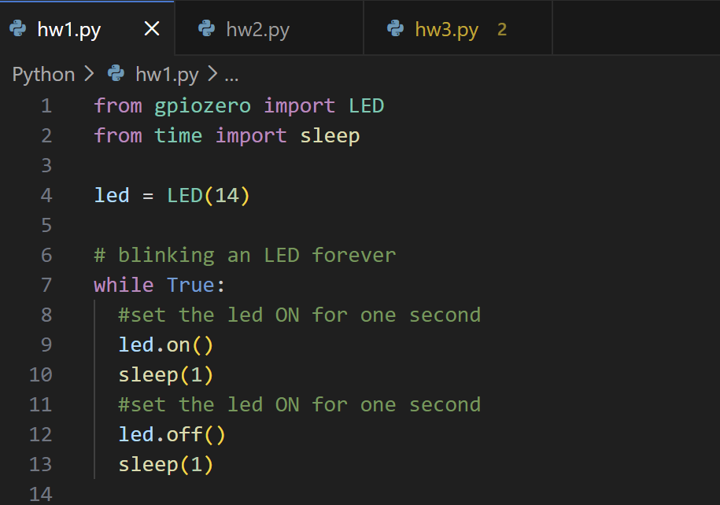

# IoT26-HW01: Control Raspberry Pi Digital Outputs with Python (LED)

## 1. Project Overview
- This assignment focuses on digital output control using Raspberry Pi. It involves building a simple LED circuit and writing a Python program to automate the blinking process. I used the gpiozero library for efficient GPIO management and verified the output through the physical LED's behavior.
## 2. Execution Screenshots
- screenshot of the IDE


## 3. Working Video
- GIF Preview:


## 4. Main Source Code
```python
from gpiozero import LED
from time import sleep

led = LED(14)

# blinking an LED forever
while True:
  #set the led ON for one second
  led.on()
  sleep(1)
  #set the led OFF for one second
  led.off()
  sleep(1)
